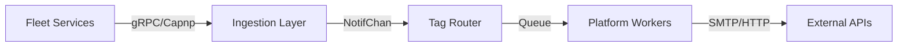

# 🏗️ Architecture Overview

The `notif-server` follows a **Centralized Aggregator / Asynchronous Dispatch** pattern.

## Key Design Pillars

1.  **Dual-Protocol Ingestion**:
    *   **TCP (Cap'n Proto)**: High-performance binary streaming with `safe-socket`.
    *   **gRPC (Protobuf)**: Modern, type-safe API for service-to-service communication.
2.  **Worker Pool Isolation**:
    *   Each notification platform (Telegram, Discord, etc.) has its own dedicated worker pool (5 workers) and buffered queue (1000 messages).
    *   Slow platforms (like SMTP/Gmail) never block fast platforms (like Telegram).
3.  **Resilient Delivery**:
    *   **Exponential Backoff**: Smart retries (3 attempts) for transient network and non-fatal API errors.
    *   **Context Deadlines**: Strictly enforced 30s timeout per delivery attempt.
4.  **Security & Identity**:
    *   **Handshake Protocol**: Mandatory identity exchange during TCP connection.
    *   **Stable Identity**: Host-based tracking ensures monitoring consistency across client restarts.

## Data Flow Diagram

